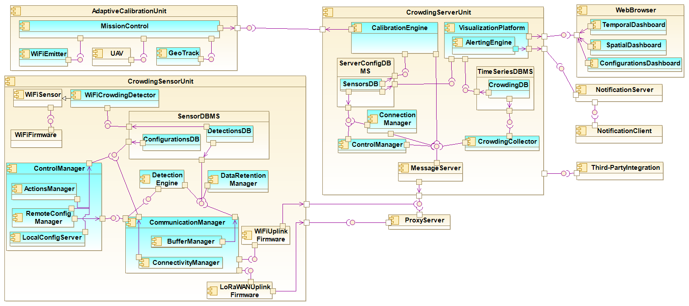
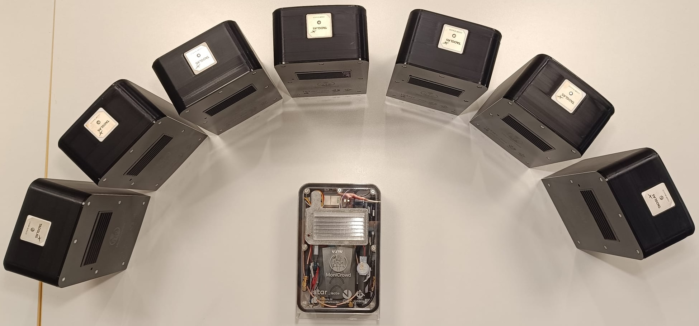
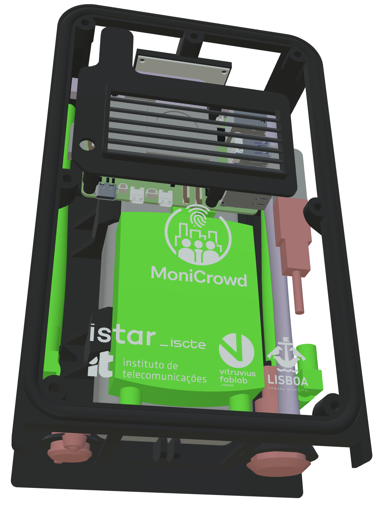
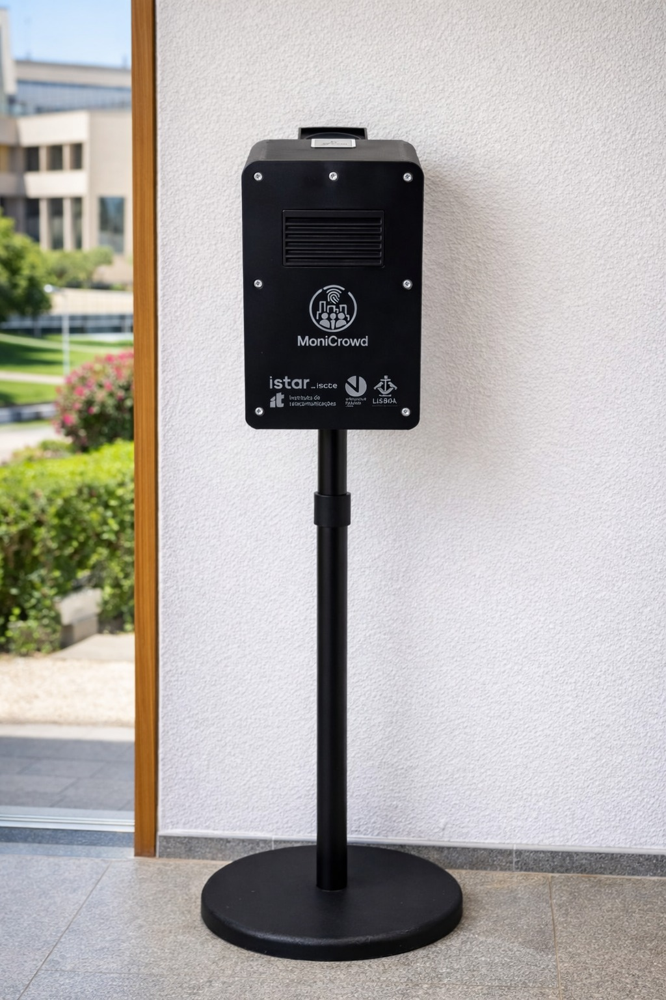
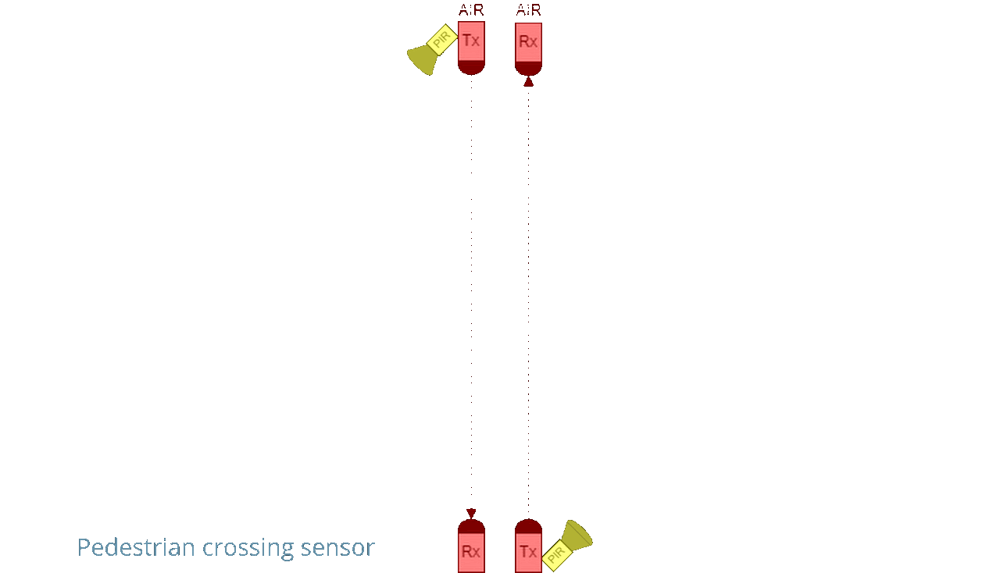
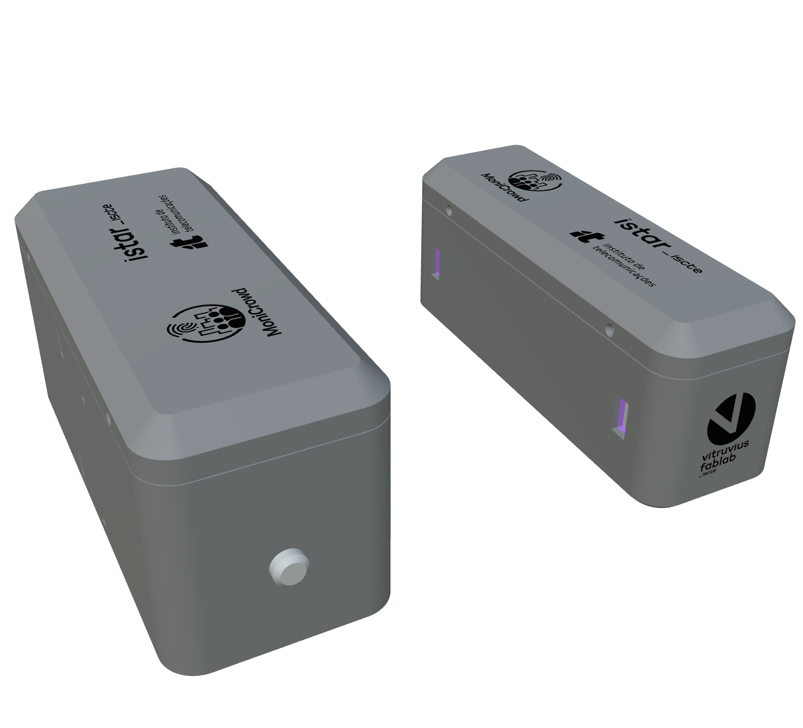
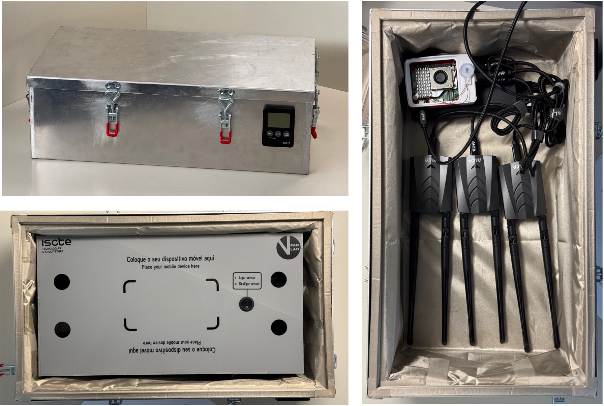
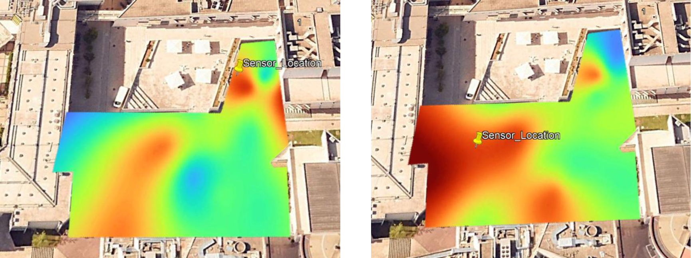

# MoniCrowd

<p>
  <b>Adaptive system for crowding monitoring using user's devices fingerprinting</b>
</p>

<p>
  
</p>

---

## Overview

MoniCrowd is an adaptive and privacy-preserving crowd sensing system designed for rapid deployment in temporary events and urban environments. It combines WiFi-based sensing with complementary sensors (e.g., infrared barrier sensors) to estimate crowd presence, flows, and dynamics without relying on cameras or personally identifiable information.

The system follows a distributed architecture with edge-based data collection and processing, and a scalable backend for real-time ingestion, visualization, and alerting.

Key features include:

- Privacy-preserving sensing (no cameras, no personal data)
- Multi-sensor integration (WiFi probes, IR barrier sensors, and others)
- Multi-RAN and multi-operator connectivity
- Seamless network handover
- Over-the-air (OTA) configuration and calibration
- Rapid deployment and portability
- Real-time monitoring and analytics

---

## Architecture

MoniCrowd is organized as a modular system composed of edge devices, backend services, and calibration tools:
```
Sensors (WiFi, IR, …)
↓
Edge Processing (crowd-sensor, barrier-sensor, …)
↓
Multi-RAN Communication (WiFi / LoRa / …)
↓
Backend (crowd-server)
↓
Dashboards & Alerts
```
The following component diagram provides a more detailed view of the system architecture, highlighting the interaction between edge sensing units, the backend platform, and the adaptive calibration subsystem. It illustrates how data flows across the edge-to-cloud pipeline, including sensing, local processing, multi-RAN communication, backend ingestion, visualization, and remote configuration.


---

## Project Website

🔗 https://monicrowd.sensinglab.eu

---

## Repositories

This repository serves as the central hub for the MoniCrowd ecosystem.

### Core Components

- **[crowd-sensor](https://github.com/sensinglab/crowd-sensor)**  
  Edge software for data collection and local processing, supporting multi-RAN and multi-operator connectivity, seamless handover, and OTA updates, implementing the CrowdingSensorUnit of the component diagram *(see Hardware Overview below)*

- **[crowd-server](https://github.com/sensinglab/crowd-server)**  
  Real-time backend for data ingestion, processing, storage, visualization, and alerting, implementing the CrowdingServerUnit of the component diagram 

- **[barrier-sensor](https://github.com/sensinglab/barrier-sensor)**  
  Low-power pedestrian detection and counting using active infrared beams, including direction detection, implementing the CrowdingSensorUnit of the component diagram *(see Hardware Overview below)*

### Calibration & Deployment

- **[faradaycage-sniffer](https://github.com/sensinglab/faradaycage-sniffer)**  
  Autonomous multi-channel WiFi probe request sniffer for controlled dataset collection in Faraday cage environments. *(see Hardware Overview below)*
  
- **[crowd-sensor-calibration](https://github.com/sensinglab/crowd-sensor-calibration)**  
  Tools for calibration and deployment optimization, enabling adaptive configuration, sensitivity mapping, and improved measurement accuracy, implementing the AdaptiveCalibrationUnit and parts of the CrowdingServerUnit of the component diagram 

## Hardware Overview

### Crowd Sensor *(crowd-sensor)*


<table>
  <tr>
    <td align="center">
      <a href="https://3dviewer.net/#model=https://raw.githubusercontent.com/sensinglab/crowd-sensor/main/sensor-case/3684_MoniCrowd_IT-ISTAR_All-ShareViz-v04.3.glb">
        
      </a><br/>
      <a href="https://3dviewer.net/#model=https://raw.githubusercontent.com/sensinglab/crowd-sensor/main/sensor-case/3684_MoniCrowd_IT-ISTAR_All-ShareViz-v04.3.glb">
        Open interactive 3D model
      </a>
    </td>
    <td align="center">
      
    </td>
  </tr>
</table>

### Barrier Sensor *(barrier-sensor)*
<table border="0" cellspacing="0" cellpadding="0">
  <tr>
    <td align="center">
      
    </td>
    <td align="center">
      <a href="https://3dviewer.net/embed.html#model=https://github.com/sensinglab/barrier-sensor/blob/main/sensor-case/3642_CaixasSendoresIR_v3_cxL-M_ShareViz_1.glb">
        
      </a><br/>
      <a href="https://3dviewer.net/embed.html#model=https://github.com/sensinglab/barrier-sensor/blob/main/sensor-case/3642_CaixasSendoresIR_v3_cxL-M_ShareViz_1.glb">
        Open interactive 3D model
      </a>
    </td>
  </tr>
</table>

### Faraday Cage Setup *(faradaycage-sniffer)*


### Calibration Setup *(crowd-sensor-calibration)*


---

## Key Capabilities

- **Privacy by design**  
  No cameras and no personally identifiable information are collected.

- **Multi-sensor fusion**  
  Combines WiFi sensing with complementary sensing technologies.

- **Adaptive deployment**  
  Sensor calibration and configuration can be dynamically adjusted.

- **Resilient connectivity**  
  Multi-RAN and multi-operator support with seamless handover.

- **Real-time analytics**  
  Continuous monitoring with dashboards and alerting mechanisms.

---

## Use Cases

- Temporary events (conferences, festivals, exhibitions)
- Public buildings and cultural venues
- Urban spaces and smart city deployments
- Indoor/outdoor hybrid environments

---

## Funding

The MoniCrowd project **2024.07624.IACDC** (https://doi.org/10.54499/2024.07624.IACDC) is supported by measure **RE-C05-i08.M04** – “Support the launch of a program of R&D projects aimed at the development and implementation of advanced cybersecurity, artificial intelligence and data science systems in public administration, as well as a scientific capacity building program of the **Recovery and Resilience Plan (PRR)**, within the framework of the financing contract signed between the Recuperar Portugal Mission Structure (EMRP) and the Portuguese Foundation for Science and Technology."

---

## Related Resources

🌐 Website: https://monicrowd.sensinglab.eu  
📊 Dataset: (Zenodo to be added)  
📚 Publications: https://monicrowd.sensinglab.eu/home/dissemination  
📣 Dissemination activities: https://monicrowd.sensinglab.eu/home/dissemination  
📍 Demonstrations & deployments: https://monicrowd.sensinglab.eu/home/deployments  

---

## Contact

- Instituto de Telecomunicações
- Associação ISCTE Conhecimento e Inovação - Centro de Valorização e Transferência de Tecnologias
- Município de Lisboa

📧 info@sensinglab.eu  
🌐 https://monicrowd.sensinglab.eu  

---

## License

© 2026 Instituto de Telecomunicações, Associação ISCTE Conhecimento e Inovação - Centro de Valorização e Transferência de Tecnologias, Iscte – Instituto Universitário de Lisboa

This project is licensed under the GNU General Public License v3.0 (GPL-3.0).

See the [LICENSE](LICENSE) file for full terms.
